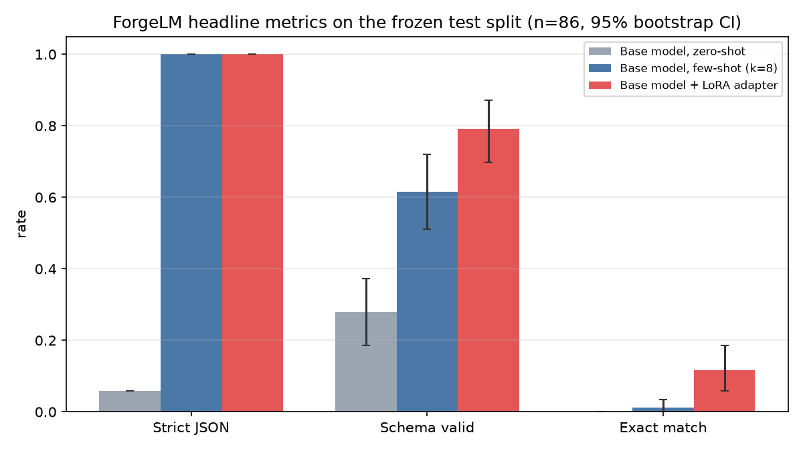
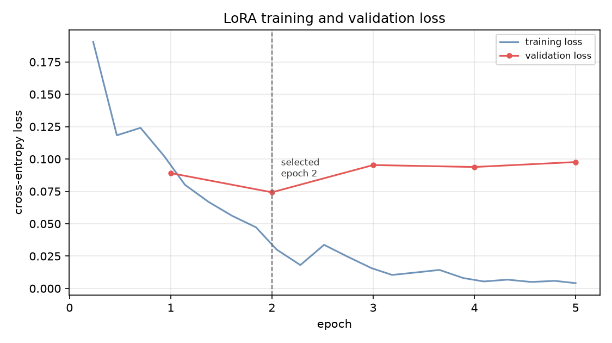

# ForgeLM

**A small, fully-executed LoRA adaptation experiment on structured output.**

Can parameter-efficient fine-tuning measurably improve a 0.5B instruction model
on a narrow structured-output task, compared with zero-shot **and few-shot** use
of the same unchanged model, on a 4 GiB consumer GPU?

Everything here ran. Every number is recomputable from raw per-example
predictions committed in `reports/predictions/`. Every failed run is preserved.
Nothing is claimed that was not measured.

---

## The experiment in one paragraph

Take `Qwen/Qwen2.5-0.5B-Instruct` (Apache-2.0, pinned to a commit hash). Give it
a synthetic IT-helpdesk triage task: read a ticket, emit exactly one JSON object
with five fields, three of them closed enums. Measure the unchanged model
zero-shot. Measure it again with eight in-prompt demonstrations. Then train a
LoRA adapter (1.75% of parameters) on 171 examples and measure it a third time --
same prompt, same decoding, same parser -- on 86 test examples drawn from
**scenario families the model has never seen**. Report with confidence intervals
and paired significance tests, because 86 examples is not many.

## Why the few-shot baseline is the point

The easy version of this project compares fine-tuning against zero-shot, finds a
huge gain, and declares victory. That comparison is close to meaningless: a base
model asked for bare JSON will wrap it in markdown fences, and *any* intervention
that fixes formatting looks transformative.

So the few-shot baseline here is deliberately strong -- k=8, one demonstration per
category, drawn only from the training split. It turned out to fix the formatting
problem completely on its own. That raised the bar LoRA had to clear, which is
exactly what a baseline is for.

---

## Results

Frozen test split, n = 86, evaluated once. Intervals are 95% percentile
bootstrap over 10,000 resamples. Full report:
**[reports/RESULTS.md](reports/RESULTS.md)**, regenerated from the raw
prediction files by `scripts/04_report.py`.

| System | Strict JSON | Schema valid | **Exact match** | Constraint violations |
|---|---|---|---|---|
| Base model, zero-shot | 5.8% | 27.9% [18.6, 37.2] | **0.0%** [0.0, 0.0] | 95.3% |
| Base model, few-shot (k=8) | 100.0% | 61.6% [51.2, 72.1] | **1.2%** [0.0, 3.5] | 38.4% |
| **Base model + LoRA** | **100.0%** | **79.1%** [70.9, 87.2] | **11.6%** [5.8, 18.6] | **20.9%** |

**All four pre-declared success criteria were met.**

| Comparison (exact match) | Difference | 95% CI | McNemar p | Verdict |
|---|---|---|---|---|
| zero-shot -> few-shot | +1.2 pp | [+0.0, +3.5] | 1.00 | not distinguishable from zero |
| zero-shot -> LoRA | +11.6 pp | [+4.7, +18.6] | 0.0020 | **difference detected** |
| few-shot -> LoRA | **+10.5 pp** | [+3.5, +18.6] | 0.0117 | **difference detected** |



### The result is real, and narrower than the headline suggests

Three things are true at once, and reporting only the first would be
misleading.

**1. LoRA beat a genuinely strong baseline.** Not just the 0.0% zero-shot
strawman -- it beat few-shot prompting, which had already achieved 100% strict
JSON on its own. Schema validity 61.6% -> 79.1% (+17.4 pp, p = 0.004).

**2. The gain is concentrated in two fields, and the apparent loss on a third
is noise.** Per-field paired tests against few-shot:

| Field | few-shot | LoRA | Difference | 95% CI | p | Verdict |
|---|---|---|---|---|---|---|
| `category` | 59.3% | 53.5% | -5.8 pp | [-17.4, +7.0] | 0.46 | no detectable difference |
| `priority` | 41.9% | 46.5% | +4.7 pp | [-11.6, +20.9] | 0.68 | no detectable difference |
| `affected_service` | 37.2% | 58.1% | **+20.9 pp** | [+9.3, +32.6] | 0.0009 | improvement |
| `is_security_incident` | 81.4% | 91.9% | **+10.5 pp** | [+2.3, +18.6] | 0.023 | improvement |
| `users_affected` | 100.0% | 100.0% | +0.0 pp | [+0.0, +0.0] | 1.00 | no detectable difference |

`category` *looks* worse under LoRA. It is not: the interval spans zero and
p = 0.46. Calling that a regression would be as wrong as calling the +4.7 pp on
`priority` an improvement.

**3. It did not learn to generalise to new situations.** This was predicted
before training and it happened:

> **11 of the 16 held-out scenario families produced zero fully correct
> outputs.**

The 11.6% exact match is concentrated in a handful of families
(`ab_expense_reimbursement` 5/5, `ab_invoice_dispute` 2/5) rather than spread
evenly. The adapter learned the *output contract* well and the *task* only
partially. Where it still breaks the schema it mostly copies a salient noun out
of the ticket instead of mapping it to the closed enum -- emitting
`affected_service: "dns"` for a DNS outage, or `"internet"`, `"display"`,
`"audio"`.

**Honest one-line summary:** on 171 examples, LoRA reliably taught a 0.5B model
*the shape of the answer*, and only partially taught it *the answer*.

### Optional ablation: doubling the training data did not help

Run afterwards as a secondary question, not pre-registered. Full report:
**[reports/ABLATION.md](reports/ABLATION.md)**. One variable changed —
86 vs 171 training examples, category-stratified, everything else identical.

| Training examples | Schema valid | Exact match |
|---|---|---|
| 86 (50%) | 82.6% | 17.4% |
| **171 (100%)** | 79.1% | 11.6% |

**Exact match: −5.8 pp, 95% CI [−12.8, +1.2], p = 0.18 — not distinguishable
from zero.** Doubling the data bought nothing measurable. Combined with the
11-of-16 zero-scoring families, that points at **scenario coverage, not example
volume**, as the binding constraint: more examples of situations the model
already sees does not help it handle situations it has never seen.

More surprising: on `category` the *smaller* training set was significantly
**better** (67.4% vs 53.5%, +14.0 pp in favour of less data, p = 0.0005). Two
explanations fit and this experiment cannot separate them — overfitting to the
32 training scenarios (5.3 repetitions each vs 2.8), or single-seed run-to-run
variance. It is reported as a hypothesis, not a result, because deleting a
surprising number for being inconvenient is worse than reporting it with its
caveat.

**The headline result does not change.** The ablation arm scored higher, and
promoting it would be exactly the post-hoc selection this project exists to
avoid: the primary experiment was pre-registered against the full training
split and the test set was evaluated once for it. The reported result remains
the 171-example run; the ablation contributes a *direction*, not a better score
to substitute in.

### Training behaved exactly as the guardrails predicted



Validation loss bottomed at **epoch 2** (0.0743) and rose thereafter while
training loss kept falling to 0.004 -- clean overfitting of 8.8M trainable
parameters on 171 examples. Early stopping fired at epoch 5 and the epoch-2
checkpoint was selected. This is why the validation split exists, and why the
split was fixed (D-006) so it contained every priority class.

---

## Architecture

```
ticket text
    |
    v
prompts.render_prompt ......... official ChatML template via apply_chat_template
    |                            identical system prompt in ALL conditions
    v
+-- zero-shot ..... unchanged base model
+-- few-shot ...... unchanged base model + 8 demos (train split only)
+-- lora .......... base model (frozen, fp16) + LoRA adapter (fp32, r=16)
    |
    v
generate.run_evaluation ....... greedy, max_new_tokens=160, batched, left-padded
    |
    v
parsing.parse_response ........ strict + lenient JSON, both reported
    |
    v
parsing.classify .............. 12-category failure taxonomy
    |
    v
metrics.compute_metrics ....... exact match, per-field accuracy, macro-F1,
    |                            constraint violations, confusion matrices
    v
metrics.compare ............... paired bootstrap CI + exact McNemar
    |
    v
reports/predictions/*.jsonl ... the primary artefact; metrics are derived
```

The critical property: **the only thing that differs between the three
conditions is the model and whether demonstrations are present.** The
instruction, decoding settings and parser are byte-identical, and the system
prompt's SHA is recorded in every run so this is provable rather than asserted.

## What is verified

Verified means it ran and left evidence. See `STATUS.md` for the full table and
`reports/EVIDENCE.md` for the machine-checked audit.

- **Deterministic dataset.** 300 examples, regenerates byte-identically from one
  seed; checksums recorded and re-verified.
- **Leakage control.** Group-aware split on scenario family. All 44,850
  cross-split pairs compared: maximum similarity **0.3255** against a 0.80 alarm
  threshold.
- **Two executed baselines** on the frozen test set before any training.
- **Six pre-flight training gates**, including a label-masking proof and a tiny
  overfit test that the gradient path works.
- **Adapter reload verified**, with an active-adapter check that *raises* if the
  LoRA weights are inert.
- **Metrics recomputed** from raw predictions and audited against the values
  recorded at run time.
- **215 tests**, including tests that deliberately poison the data to prove the
  leakage and duplicate detectors actually fire, and one that saves an
  untrained adapter to prove the liveness guard rejects it.
- **CI green on GitHub Actions** — CPU-only, offline, no GPU and no model
  weights. Every headline number re-derives from the committed per-example
  predictions on a machine that has never downloaded the model.
- **Reproduced on independent hardware.** The notebook was executed on a Colab
  T4 (Linux, torch 2.11+cu128) and selected the same checkpoint, stopped at the
  same epoch, and produced `exact_match` identical to four decimal places.

## Repository map

| Path | What it is |
|---|---|
| `src/forgelm/` | All reusable logic. Notebooks and scripts orchestrate; they do not hide implementation. |
| `src/forgelm/schema.py` | The output contract. Single source of truth. |
| `src/forgelm/datagen.py` | Synthetic data generator: 56 scenario families x 8 writing styles. |
| `src/forgelm/splits.py` | Group-aware, severity-stratified, checksummed splitting. |
| `src/forgelm/validate.py` | QC and leakage detection. |
| `src/forgelm/prompts.py` | Chat-template prompt construction; demonstration selection. |
| `src/forgelm/parsing.py` | Response parsing and the failure taxonomy. |
| `src/forgelm/metrics.py` | Metrics, bootstrap CIs, McNemar. |
| `src/forgelm/training.py` | Encoding, prompt masking, collation, Trainer construction. |
| `src/forgelm/ledger.py` | Reproducibility ledger. |
| `scripts/00_build_dataset.py` | Generate, validate, split, freeze. CPU only. |
| `scripts/01_evaluate.py` | Evaluate any condition on any split. |
| `scripts/02_smoke_train.py` | Six pre-flight gates. |
| `scripts/03_train_lora.py` | Train the adapter. |
| `scripts/04_report.py` | Recompute metrics from predictions; build report and figures. |
| `scripts/05_review_sample.py` | Dump a stratified sample for human reading. |
| `scripts/06_audit.py` | Final evidence audit. Exits non-zero on any failure. |
| `scripts/07_ablation_report.py` | Paired comparison of the primary run against a controlled ablation, kept separate so an exploratory number is not read with the same weight as the pre-registered one. |
| `scripts/demo_app.py` | Local demonstration. Not a deployment. |
| `notebooks/forgelm_colab.ipynb` | The teaching artefact: 50 cells, end to end. |
| `runs/` | One JSON record per executed run, including failures. |
| `reports/predictions/` | Raw per-example predictions -- the primary evidence. |
| `data/` | Dataset, split manifest, checksums. |
| `artifacts/lora_adapter/` | The trained adapter plus its provenance file. |

## Quick start

```bash
python -m venv .venv && .venv/Scripts/activate
pip install torch==2.13.0 --index-url https://download.pytorch.org/whl/cu126
pip install -r requirements.txt
```

Then, in order:

```bash
python scripts/00_build_dataset.py
```

```bash
python scripts/01_evaluate.py --condition zeroshot --split test
```

```bash
python scripts/01_evaluate.py --condition fewshot --split test
```

```bash
python scripts/02_smoke_train.py
```

```bash
python scripts/03_train_lora.py
```

```bash
python scripts/01_evaluate.py --condition lora --split test --adapter artifacts/lora_adapter
```

```bash
python scripts/04_report.py --split test
```

```bash
python scripts/06_audit.py --with-model
```

Run the tests:

```bash
pytest tests/
```

Just the fast ones (no model download):

```bash
pytest tests/ -m "not slow"
```

### Colab — verified on a T4

[**Open the notebook in Colab**](https://colab.research.google.com/github/ameenpasha69/forgelm/blob/main/notebooks/forgelm_colab.ipynb)
→ *Runtime → Change runtime type → T4 GPU* → *Run all*. ~40 min.

It runs the whole experiment with an explanation before every cell: what the
cell does, why it is needed, what may fail, and how to read the output.

**It has been run there, and it reproduced this repository's results on
hardware sharing nothing with the reference machine but its compute
capability.**

| | Reference (Windows, GTX 1650) | Colab (Linux, Tesla T4) |
|---|---|---|
| torch / CUDA build | 2.13.0+cu126 | **2.11.0+cu128** |
| OS | Windows 11 | **Linux 6.6.122** |
| VRAM | 4.0 GiB | 15.0 GiB |
| Optimiser steps | 110 | **110** |
| Early stopping | epoch 5 of 8 | **epoch 5 of 8** |
| Selected checkpoint | epoch 2 | **epoch 2** |
| Best validation loss | 0.0743 | **0.0732** |
| Training wall clock | 2202 s | **204 s** |

**`exact_match` came out identical to four decimal places** — 0.0000 /
0.0116 / 0.1163 for zero-shot / few-shot / LoRA.

Four secondary metrics moved by one to three examples out of 86
(`schema_valid_rate`, and two field accuracies). Floating-point matmul differs
across GPU architectures, so borderline greedy generations diverge. The
zero-shot condition is identical on every metric, and `exact_match` never
moved — the flips turned wrong answers into differently-wrong answers. v1 said
bit-exact determinism was not claimed and that results would differ more on
different hardware; that is now measured rather than asserted.

**The run also found a bug that was invisible locally.** peft raised
`ImportError: Found an incompatible version of torchao ... 0.10.0` inside
`get_peft_model()` — Colab preinstalls torchao 0.10.0, and recent peft rejects
anything below 0.16 when it probes for one. This machine has no torchao at all,
so the probe returned cleanly and nothing surfaced. Fixed by removing torchao
before installing peft; ForgeLM never uses quantisation. Full record in
[`experiments/v2/STATUS.md`](experiments/v2/STATUS.md).

---

## v2 — the continuation that audits this one

The results above are v1, and they stand as recorded. A follow-up
(`experiments/v2/`, branch `v2-continuation`) addresses four weaknesses that
v1's own evidence exposed, without editing any v1 artefact.

**Two corrections that change how the table above should be read.**

**1. v1 reported one training run.** Three seeds of the identical configuration
give exact match of **11.6% / 8.1% / 22.1%**. All three still beat few-shot, so
the conclusion holds — but the seed spread (14.0 pp) is larger than the weakest
seed's entire effect (+7.0 pp). *"LoRA beats few-shot"* is supported; *"by about
10 points"* is **not**.

**2. Much of the gain was format compliance, which a grammar gives away free.**
Constraining the decoder so illegal output is unrepresentable — no training,
applied identically to both systems:

| Condition | Schema valid | Exact match |
|---|---|---|
| few-shot, unconstrained | 61.6% | 1.2% |
| LoRA, unconstrained | 79.1% | 11.6% |
| few-shot, **constrained** | 100% | **8.1%** |
| LoRA, **constrained** | 100% | **16.3%** |

The decoder alone lifted the *base* model by **+7.0 pp (p = 0.031)** — more than
it lifted the fine-tuned one. So v1's headline was measuring, in substantial
part, format compliance that a grammar provides for free.

On v1's test split the like-for-like comparison (+8.1 pp, p = 0.19) was **not**
significant, which looked at first like the adapter's advantage dissolving.
**It was a power limitation, not a dissolving effect.** Repeating the same
like-for-like comparison on the larger, better-balanced sealed v2 set settles
it:

| Test set | Decoding | LoRA − few-shot | p |
|---|---|---|---|
| v1 test (n=86) | unconstrained | +10.5 pp | 0.012 |
| v1 test (n=86) | constrained | +8.1 pp | **0.19** |
| v2 sealed (n=96) | unconstrained | +26.0 pp | <0.0001 |
| **v2 sealed (n=96)** | **constrained** | **+31.2 pp** | **<0.0001** |

**Constraining the decoder removes format failures for both systems; the
adapter's remaining advantage is real and large.** Constrained LoRA reaches
**40.6%** exact match on scenario families that did not exist when it was
trained.

| v1 weakness | v2 response | Outcome |
|---|---|---|
| One seed per condition | 3 seeds, all reported, none promoted | conclusion survives, magnitude does not |
| Ablation dropped a scenario family | Equal-count, label-matched coverage arms | **no detectable difference** (−0.0 pp) |
| 18/86 outputs had invented enum values | Constrained decoding, applied symmetrically | schema failures eliminated for both; adapter advantage survives at **+31.2 pp** on the sealed set |
| Test split had been seen | A sealed v2 set: 96 examples, 32 new families | evaluated once; **LoRA 29.2%** vs few-shot 3.1% |

See [`experiments/v2/STATUS.md`](experiments/v2/STATUS.md) and
[`experiments/v2/PREREGISTRATION.md`](experiments/v2/PREREGISTRATION.md)
(written before any v2 run).

## Documentation

| Document | Contents |
|---|---|
| [`STATUS.md`](STATUS.md) | Per-component status with evidence, plus surprising findings |
| [`DECISIONS.md`](DECISIONS.md) | Every non-obvious decision, alternatives rejected, and why |
| [`DATASET_CARD.md`](DATASET_CARD.md) | Data origin, generation, composition, biases, prohibited use |
| [`MODEL_CARD.md`](MODEL_CARD.md) | What the adapter is, how to load it, what it must not be used for |
| [`EXPERIMENT_CARD.md`](EXPERIMENT_CARD.md) | Full protocol, environment, failed runs, reproduction steps |
| [`reports/RESULTS.md`](reports/RESULTS.md) | Metrics, intervals, paired tests, failure taxonomy |
| [`reports/EVIDENCE.md`](reports/EVIDENCE.md) | Machine-checked final audit |

---

## Two-minute demonstration

*(Presenting this to someone? [`DEMO.md`](DEMO.md) is a timed 10-minute
walkthrough with the questions to expect and what to say.)*

If you have two minutes and want to see whether this is real:

1. **Open [`reports/RESULTS.md`](reports/RESULTS.md).** Every number there was
   recomputed from raw predictions, not copied from a log.
2. **Open [`reports/predictions/lora_test.jsonl`](reports/predictions/lora_test.jsonl)
   and read one line.** It contains the full rendered prompt, the raw model
   output, the parsed object, the expected object, per-field correctness and an
   error category. Every metric is derived from these; nothing is asserted.
3. **Run the audit:**
   ```bash
   python scripts/06_audit.py
   ```
   It re-derives the dataset from its seed, re-verifies three checksums,
   recomputes every metric from the prediction files and compares them to what
   was recorded at run time, runs the test suite, and greps the documentation
   for claims the evidence does not support. It exits non-zero on any failure.
4. **Try the adapter yourself:**
   ```bash
   python scripts/demo_app.py --cli --compare
   ```
   Type a ticket; see the unchanged base model and the adapted model side by
   side.


## Limitations

Stated plainly, because a portfolio project that hides these is worth less than
one that names them:

- **The data is synthetic.** Nothing here predicts behaviour on real helpdesk
  tickets. Real ones are messier, longer, and frequently omit the information
  needed to label them at all.
- **86 test examples.** Confidence intervals are wide by construction. Small
  differences are not interpretable, and the report says so for each comparison.
- **Only 3 `medium`-priority examples in the test split**, so priority macro-F1
  is noisy. Rebalancing the labels to flatter the metric was rejected.
- **One training run, one seed.** No multi-seed variance estimate. A single run
  is a sample of size one.
- **Urgency language correlates with severity** in the generated tickets. This is
  realistic but is a shortcut the model can partly exploit; it is disclosed in
  the dataset card rather than engineered away.
- **One prompt.** Format compliance is tied to the system prompt used in
  training.
- **It did not generalise to most unseen scenarios.** 11 of 16 held-out
  families scored zero. The headline 11.6% is concentrated, not uniform.
- **Not measured, therefore not claimed:** safety, alignment, fairness,
  robustness, adversarial resistance, latency under load, cost, or any
  behaviour outside this dataset.
- **The ablation is one run per arm.** A 14-point per-field swing from a single
  seed each is not separable from seed variance. Settling it needs 3–5 seeds per
  arm, which was not run.
- **The ablation's manipulation is not perfectly clean.** Stratifying the
  subsample by category rather than by family dropped one scenario family
  (`email_dl_update`) as a side effect, so it is a ~52% depth cut at 97%
  coverage rather than a pure depth cut.
- **Only one ablation axis was tested.** `configs/ablation_r8.json` and
  `configs/ablation_nodropout.json` are wired up but were not executed, so no
  claim is made about LoRA rank or dropout.

---

## What this project is not

No claim is made anywhere in this repository about production readiness,
deployment readiness, alignment, safety, fairness, robustness, latency
improvement, cost reduction, general capability improvement, domain expertise,
QLoRA, quantisation, vLLM, MLflow, distributed training, human-preference
optimisation, RAG, agentic capability, or real-world reliability. None of those
were measured. `scripts/06_audit.py` greps the documentation for exactly these
claims and fails the build if one appears outside a disclaiming sentence.

## Licence

MIT for the code, the synthetic dataset and the adapter weights. The base model
is Apache-2.0 and is **not** redistributed here; only the adapter, with a
provenance file naming the exact base revision it requires.
